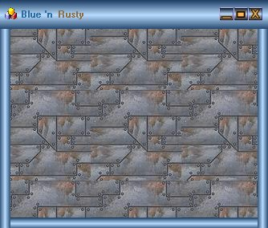



## How to customize borderless form

### Description

Shows some technique on how to customize borderless forms to make them move, resize, tile background picture. Code is commented.
 
### More Info
 

             |
---                |---
**Submitted On**   |2002-03-23 16:41:04
**By**             |[Gurgen Alaverdian](https://github.com/Planet-Source-Code/PSCIndex/blob/master/ByAuthor/gurgen-alaverdian.md)
**Level**          |Intermediate
**User Rating**    |5.0 (25 globes from 5 users)
**Compatibility**  |VB 6\.0
**Category**       |[Custom Controls/ Forms/  Menus](https://github.com/Planet-Source-Code/PSCIndex/blob/master/ByCategory/custom-controls-forms-menus__1-4.md)
**World**          |[Visual Basic](https://github.com/Planet-Source-Code/PSCIndex/blob/master/ByWorld/visual-basic.md)
**Archive File**   |[How\_to\_cus648433232002\.zip](https://github.com/Planet-Source-Code/gurgen-alaverdian-how-to-customize-borderless-form__1-32973/archive/master.zip)

